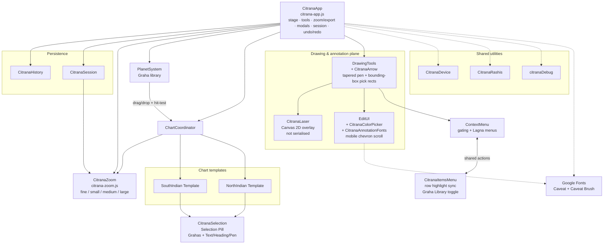

# Citrana Architecture

This document describes how Citrana is structured at a system level: runtime composition, module boundaries, data flows, and safe extension points. For feature-level documentation and usage guidance, see [AGENT.md](AGENT.md) and [README.md](README.md).

## Table of Contents

1. [Terminology](#terminology)
2. [Design Principles](#design-principles)
3. [Runtime Composition](#runtime-composition)
4. [High-Level Component Diagram](#high-level-component-diagram)
5. [Module Responsibilities](#module-responsibilities)
6. [Canvas Object Naming](#canvas-object-naming)
7. [Graha Data Model](#graha-data-model)
8. [Key Data Flows](#key-data-flows)
9. [Global State](#global-state)
10. [Debug logging](#debug-logging)
11. [UI Architecture](#ui-architecture)
12. [Undo / redo](#undo--redo)
13. [Extension Points](#extension-points)
14. [Known Limitations](#known-limitations)
15. [Related Documentation](#related-documentation)

## Terminology

User-facing copy and docs use **Bhava**, **Graha**, and **Rashi** (with correct capitalisation and plurals). Legacy identifiers in source (`house`, `planet` in filenames, methods, Konva node names, and serialised keys) remain for compatibility.

## Design Principles

- **Browser-only**: No build step, no server runtime. Open `index.html` or deploy static files to GitHub Pages.
- **Canvas-first**: Chart layout, Grahas, and drawings live on a single Konva.js stage/layer.
- **Floating DOM UI**: Toolbars, modals, Graha library, and edit panels are HTML/CSS overlays; the canvas handles chart interaction.
- **Global coordinator**: `window.app` (`CitranaApp`) is the integration hub. Modules reference it for cross-cutting actions.
- **Template delegation**: South and North Indian charts are separate classes; `ChartCoordinator` routes by `currentChartType`.

## Runtime Composition

`index.html` sets `viewport-fit=cover`, loads Konva and colorpicker CSS in `<head>`, Google Fonts (Caveat / Caveat Brush), then scripts at the bottom in this order:

| Order | Path | Export / role |
|-------|------|---------------|
| — | `index.html` | Application entry point |
| 1 | `assets/vendor/konva.min.js` | Konva 9.3.20 (loaded in `<head>`) |
| 2 | `assets/vendor/lucide.min.js` | Lucide 0.576.0 icons |
| 3 | `assets/vendor/colorpicker.iife.min.js` | JSColorPicker 1.1.0 |
| 4 | `assets/js/citrana-debug.js` | `window.citranaDebug` (on by default) |
| 5 | `assets/js/citrana-device.js` | `CitranaDevice` |
| 6 | `assets/js/citrana-rashis.js` | `CitranaRashis` |
| 7 | `assets/js/citrana-selection.js` | `CitranaSelection` (Selection Pill) |
| 8 | `assets/js/citrana-annotation-fonts.js` | `CitranaAnnotationFonts` (Normal / Hand-written) |
| 9 | `assets/js/citrana-chart-templates-south.js` | `SouthIndianChartTemplate` |
| 10 | `assets/js/citrana-chart-templates-north.js` | `NorthIndianChartTemplate` |
| 11 | `assets/js/citrana-zoom.js` | `CitranaZoom` (zoom step presets) |
| 12 | `assets/js/citrana-chart-coordinator.js` | `ChartCoordinator` |
| 13 | `assets/js/citrana-planet-system.js` | `GrahaSystem` (`PlanetSystem` class) |
| 14 | `assets/js/citrana-arrow.js` | `CitranaArrow` |
| 15 | `assets/js/citrana-colorpicker.js` | `CitranaColorPicker` |
| 16 | `assets/js/citrana-laser.js` | `CitranaLaser` |
| 17 | `assets/js/citrana-drawing-tools.js` | `DrawingTools` |
| 18 | `assets/js/citrana-edit-ui.js` | `EditUI` |
| 19 | `assets/js/citrana-context-menu.js` | `ContextMenu` |
| 20 | `assets/js/citrana-items-menu.js` | `CitranaItemsMenu` |
| 21 | `assets/js/citrana-history.js` | `CitranaHistory` |
| 22 | `assets/js/citrana-session.js` | `CitranaSession` |
| 23 | `assets/js/citrana-app.js` | `CitranaApp` → `window.app` on `DOMContentLoaded` |

**Script order is dependency order, not alphabetical.** Classic `<script>` tags expose globals; each file must load after its dependencies. `citrana-app.js` is always last. Do not reorder `index.html` scripts A–Z — see [AGENT.md](AGENT.md) — Script load order for the full list and rules when adding modules.

Script order summary: vendor libs first; `citrana-debug.js`, then `citrana-device.js` and `citrana-rashis.js` before `citrana-selection.js` and `citrana-annotation-fonts.js`; chart templates, then `citrana-zoom.js`, then coordinator before `citrana-planet-system.js`; `citrana-arrow.js` before `citrana-colorpicker.js`; `citrana-laser.js` before `citrana-drawing-tools.js`; `citrana-context-menu.js` before `citrana-items-menu.js`; `citrana-history.js` and `citrana-session.js` immediately before `citrana-app.js`.

## High-Level Component Diagram



`CitranaZoom` (`citrana-zoom.js`) centralises zoom step math (`computeNextScale`) for toolbar buttons, keyboard **+**/**−**, scroll wheel (`app.handleWheel()`), and `ChartCoordinator.zoomIn()` / `zoomOut()`. Step preference (`fine` | `small` | `medium` | `large`) lives in `app.options.zoomStep`, `localStorage.citrana_zoom_step`, and `.citrana.json` session `options`. `CitranaDevice` and `CitranaRashis` are used across `citrana-app.js`, chart templates, `citrana-drawing-tools.js`, `citrana-context-menu.js`, and `citrana-laser.js`. `CitranaSelection` attaches the dashed Selection Pill behind selected Grahas and text/heading/pen stroke annotations. `CitranaAnnotationFonts` is consumed by `citrana-edit-ui.js` and preloaded from `citrana-app.js` on init. `app.getCanvasSelection()` / `notifyCanvasSelectionChanged()` keep the Canvas Items panel in sync. `CitranaHistory` is wired in `app.setupComponents()` for undo/redo snapshots; `CitranaSession` captures the same serialised chart + drawing payload for `.citrana.json` export.

## Module Responsibilities

| Module | Lines | Primary role |
|--------|-------|----------------|
| `citrana-app.js` | ~2214 | Application lifecycle, Konva stage, tool routing, keyboard shortcuts (**K** laser; **I** Canvas Items toggle; centralised **Delete**; **Escape** modal dismiss; **Tab** focus trap), zoom lock, **Zoom Step** preference (`setZoomStep()`), export (full viewport or chart-only crop), shared progress modal (`showProgressModal`; `isExporting` / `isSessionBusy` guards), modals, chart display preferences, history, **Presentation View**, **Save/Open Session**, **Welcome modal** (`showWelcomeModal`, `clearWelcomeLoadingInterval`), **Canvas Items** panel init, toolbar scroll; `clearCanvasSelection()`, `getCanvasSelection()`, `notifyCanvasSelectionChanged()`; `applySaveChartOnlyTransparency()` restores white background when Save Chart Only off; touch `preventDefault` gated via `drawingTools.shouldPreserveTouchDrag()`; `isModalBlockingShortcuts()` blocks shortcuts when modals open |
| `citrana-zoom.js` | ~58 | Zoom step presets — `CitranaZoom.computeNextScale()`, `resolveZoomStep()`, `VALID_STEPS` (`fine` 1%, `small` ~10%, `medium` ~20%, `large` ~25%); used by app wheel zoom, coordinator zoom buttons, and session import/export |
| `citrana-annotation-fonts.js` | ~118 | Normal vs Hand-written annotation typography — Arial / Arial Black vs Caveat / Caveat Brush; `setBold` / `setItalic` / `setMode`; `ensureLoaded()` for Google Fonts |
| `citrana-history.js` | ~94 | Unified undo/redo timeline (`CitranaHistory`) |
| `citrana-chart-coordinator.js` | ~320 | Unified API over South/North templates; zoom (`zoomIn`/`zoomOut` via `CitranaZoom`; `zoomToFit` routes by `currentChartType`); chart serialisation; pointer-to-bhava hit-test; chart-only export crop bounds |
| `citrana-chart-templates-south.js` | ~989 | 4×4 grid chart, bhava numbering, Lagna indicator, centre label, indicator visibility, `zoomToFit()` with local bounds (compact viewport fixed **65%**); `skipZoomToFit` on undo restore; `selectPlanet()` / `clearSelectedPlanet()` via `CitranaSelection`; `CitranaRashis` / `CitranaDevice` |
| `citrana-chart-templates-north.js` | ~1015 | Diamond polygon chart, rashi boxes, Lagna rashi math, indicator visibility (`tinyBoxGroupNorth`), `zoomToFit()` with local bounds (compact viewport fixed **82%**); `skipZoomToFit` on undo restore; `selectPlanet()` / `clearSelectedPlanet()` via `CitranaSelection`; `raiseDrawingsAboveChart()` / `syncNorthChartLayerOrder()`; `CitranaRashis` / `CitranaDevice` |
| `citrana-planet-system.js` | ~962 | Graha library UI (5 pages, 60 Grahas — Page 5: Upagrahas and outer Grahas), `fullName` library labels, no-scroll grid layout, visibility toggle (`citrana_graha_library_enabled`, `#graha-library.graha-library-hidden`), dots-bar swipe paging with mobile chevron hints, keyboard **1**–**5** via `goToPage()`, drag-and-drop via coordinator hit-test, `clearSelectedBhavaDropTarget()` |
| `citrana-arrow.js` | ~185 | Unified filled-arrow geometry (`Konva.Line` polygon); `arrowAnchors`; legacy `Konva.Arrow` migration |
| `citrana-colorpicker.js` | ~388 | JSColorPicker v1.1.0 theme, swatches, chip toggles, alpha; `applyToKonvaArrow()` / `fromKonvaShape()`; `isPickerPopupTarget()` for touch-outside dismiss |
| `citrana-device.js` | ~39 | Shared `isTouchDevice()`, `isMobileUA()`, `isCompactViewport()`, `isLaserViewport()` (all viewports), `hasFinePointer()` |
| `citrana-rashis.js` | ~49 | Shared `RASHIS` (`icon`: Lucide `zodiac-*`), `NAMES`, `NUMBERS`, `getName()`, `getNumberForHouseIndex()`, `iconHtml()` |
| `citrana-selection.js` | ~99 | Selection Pill — dashed transparent `Konva.Rect` (`selection-pill`) behind selected Graha labels and text/heading/pen stroke annotations; `attach()` / `sync()` / `detach()`; pen uses bounds from `getTaperedPenBoundsInLayer()`; extra padding on mobile |
| `citrana-laser.js` | ~248 | Ephemeral laser pointer — Canvas 2D overlay above stage; independent strokes per gesture; ~3s fade; `isAvailable()` → `CitranaDevice.isLaserViewport()`; not serialised or undoable |
| `citrana-drawing-tools.js` | ~3270 | Drawing tools, selection, control points (desktop hover/drag feedback; `raiseControlPointsAbovePickRects()`), Graha text editing, `CitranaArrow.create()`, tapered pen (`Konva.Shape` + `penTaper` attrs + `bounding-box-pen` pick rects), pen select/drag/edit (`bindPenPickRectInteraction`, `beginManualPenDrag`, `editPenAnnotation`), `CitranaLaser` delegation, multi-line `startInlineContentEdit()`, `bindRestoredDrawingInteractions()`; history `recordHistory()` calls (laser excluded); notifies `app.notifyCanvasSelectionChanged()` on select/clear; `CitranaSelection` for annotation text and pen; `CitranaDevice` for touch/mobile |
| `citrana-edit-ui.js` | ~1030 | Floating property editor; colour chips via `CitranaColorPicker.createInput()` (session-based undo on close); `getEditTarget()` for stable pen node; Normal / Hand-written font toggles via `CitranaAnnotationFonts`; mobile chevron scroll (`setupEditUIScroll`, `#edit-ui-scroll-*`); touch-outside dismiss excludes picker popup and `.konva-textarea` |
| `citrana-context-menu.js` | ~742 | Right-click / long-press menus; `resolveDefaultCanvasContextMenuEnabled()` (off on touch-primary until set); `shouldBlockCanvasContextMenu()`; **Presentation View**; North **Set Lagna as …** flyout; `isCanvasContextMenuEnabled()` / `toggleCanvasContextMenu()`; Items row helpers `getContextMenuItemsTitle()` / `getContextMenuItemsMeta()` |
| `citrana-items-menu.js` | ~846 | **Canvas Items** panel (`#items-menu-btn`, shortcut **I**); pinned header/description + `#items-modal-nav` Section Anchors; scrollable `#items-modal-body` only; mobile Section Anchor edge fades; Chart/**Canvas**/Bhava/Graha/Annotation sections; **Clear Selection**, **Context Menu**, **Graha Library** (On/Off, green/red row tint); `.items-row-selected` sync; reuses `ContextMenu.handleAction()`; Text/Heading **Edit text** + **Style** |
| `citrana-session.js` | ~225 | Save/open `.citrana.json` (`format: citrana-session`, `version: 1`); `capture()`, `validate()`, `download()`, `applyOptions()` (includes `zoomStep`) |
| `citrana-debug.js` | ~13 | Opt-out contributor trace logging (`citranaDebug()` used across app, templates, coordinator, menus, drawing tools, Graha system) |
| `styles.css` | ~3040 | Light theme, floating UI, safe areas, iOS PWA layout, primary `@media (max-width: 768px)` block plus post-base mobile overrides (Help/About, modals), Graha library grid (`.page-dots-chevron`, `#graha-library.graha-library-hidden`), JSColorPicker `--cp-*` theme, `.items-*` panel (`.items-section-nav-wrap`, `.items-section-nav-scroll-wrap`, `.items-section-chip`, `.items-row-context-menu-on/off`, `#items-modal` pinned layout, `--items-scrollbar-gutter`), `.toolbar-scroll-*` (toolbar + Edit UI edge fades), `.help-modal-description`, `.help-intro`, `.help-subsection-title`, `.citrana-laser-canvas`, `body.presentation-view` (includes `.floating-text-edit-controls`, `.floating-edit-ui`), Help/About `--corner-btn-size` (48px desktop; 50px mobile) |

## Canvas Object Naming

Konva nodes use predictable `name` values for hit-testing and cleanup:

| Pattern | Example | Purpose |
|---------|---------|---------|
| `house-{n}` | `house-7` | Bhava hit area |
| `planet-{abbr}-{house}-{id}` | `planet-Su-4-abc123` | Graha label text |
| `planet-hit-{id}` | `planet-hit-abc123` | Invisible drag/select target |
| `selection-pill` | — | Selection Pill behind selected Graha and annotation text/pen bounds (`CitranaSelection`) |
| `drawing-{type}` | `drawing-arrow`, `drawing-pen` | User-drawn annotations — arrows as filled `Konva.Line` polygon (`CitranaArrow`; attrs `arrowAnchors`, …); tapered pen as custom `Konva.Shape` (`penTaper`, `penTaperPoints`, `penTaperWidths`, `penStrokeColor`, `penBaseWidth`) |
| `bounding-box-{type}` | `bounding-box-pen`, `bounding-box-line`, `bounding-box-arrow` | Invisible pick rects for Select-tool hit-testing; `listening` only when Select active; pen uses `bindPenPickRectInteraction()`; control points raised above via `raiseControlPointsAbovePickRects()` |
| `south-indian-chart` / `north-indian-chart` | — | Chart root groups |

## Graha Data Model

Each placed Graha is stored in the active template's `houseData` as an object on the Bhava's `grahas` array.

**South Indian** (`houseDataSouth[houseNumber].planets[]`):

```javascript
{
  abbr: 'Su',
  label: 'Su-20',
  id: 'unique-id',
  color: '#e2792e',
  retrograde: false
}
```

**North Indian** (`houseDataNorth[houseNumber].planets[]`) adds rashi tracking:

```javascript
{
  abbr: 'Su',
  label: 'Su',
  id: 'unique-id',
  color: '#e2792e',
  rashiNumber: 5,
  retrograde: true
}
```

Rendering uses `label` and `color` for `Konva.Text`, and `retrograde` drives `textDecoration: 'underline'`. The label string is never modified to indicate retrograde.

### Retrograde

- **Display**: Underlined Graha text on canvas.
- **Storage**: `retrograde: boolean` on Graha data.
- **Editing**: Double-click Graha, right-click → **Edit Graha**, or Edit UI → retrograde button (↺)
- **Persistence**: `retrograde` is included in in-memory chart serialisation (`getChartData()` / undo snapshots); not restored after page refresh
- **Legacy**: Labels containing the old Unicode subscript `ᵣ` are stripped on ingest; `retrograde` is set to `true`.

## Key Data Flows

### Create chart

1. User right-clicks canvas → `ContextMenu.showChartMenu()`
2. User selects chart type → `ChartCoordinator.createSouthIndianChart()` or `createNorthIndianChart()`
3. Template builds Konva groups, calls `zoomToFit()`

### Place Graha (library drag-and-drop)

1. User drags from Graha library → `PlanetSystem.handleDrop()` (desktop) or `handleMobileDrop()` (touch)
2. Target bhava resolution (first match wins):
   - **Selected bhava** (one-shot): `window.selectedBhavaSouth` or `window.selectedBhavaNorth` if the user clicked a Bhava first — cleared after the next successful drop (`PlanetSystem.clearSelectedBhavaDropTarget()`), when clicking empty canvas (`citrana-app.js` `mousedown`/`tap`), or on mobile tap on empty stage
   - **Pointer hit-test**: `ChartCoordinator.findHouseAtPointer()` or `findHouseAtClientPoint()`
3. Coordinator converts coords with `stagePointerToChartCoords()` / `clientToChartCoords()`, then delegates to template `findHouseAtChartPoint()`:
   - **South**: axis-aligned rectangle test; nearest-centre fallback
   - **North**: `isPointInPolygon()`; nearest-centroid fallback
4. `ChartCoordinator.addPlanetToHouse()` → template `updatePlanetsInHouse()`

### Set Lagna

- **South Indian**
  - Bhava menu only → **Set as Lagna** on the clicked bhava (no chart-level Lagna menu)
  - `set-lagna` action → `setLagnaHouse(visualHouseNumber)`; `loadChartData()` restores with `{ skipSnapshot: true }`
  - Bhava menu header uses `getBhavaNumberForHouse()` — **Bhava N** counts from Lagna
- **North Indian**
  - Chart menu → **Set Lagna as …** → pick Rashi from `CitranaRashis.RASHIS` (`set-lagna` with `data-house` 1–12 = Rashi)
  - Bhava menu → **Set as First Bhava** → `set-first-house` → `getRashiNumberForHouse(visualHouse)` → `setLagnaHouse(rashi)`
  - `lagnaHouseNorth` stores **Rashi** (1–12), not visual Bhava index
  - `setLagnaHouse(n, options?)` → renumber rashi boxes, `repositionPlanetsForNewLagna()`; `options.skipSnapshot` on undo restore

`set-lagna` requires a `houseNumber`; if missing, the action is skipped (no default fallback).

### Context menus

**Gating** (`shouldBlockCanvasContextMenu`): Canvas context menus are suppressed when the user has disabled them (`isCanvasContextMenuEnabled()`), while `app.isDrawing`, or when the active tool is not Select/Hand. Reduces touch conflicts during drawing.

**Unified routing** (`openContextMenuAtClientPoint`):

1. `getShapeAtClientPoint()` → `stage.getIntersection(pos)`
2. `resolveContextTarget()` walks Konva names: `house-*`, `planet-hit-*`, `planet-{abbr}-{house}-{id}`
3. Bhava → `showHouseMenu()`; Graha → `showPlanetMenu()`; else → `showChartMenu()`

**Desktop**: right-click on `#canvas-container` and Konva `contextmenu` on Bhavas/Grahas (with `stopPropagation`).

**Mobile**: 500ms long-press on canvas uses the same hit-test routing (not chart-menu-only).

| Menu | Trigger | Key actions |
|------|---------|-------------|
| Create | Empty canvas | North/South chart, **Presentation View**, Clear Canvas |
| Existing chart | Canvas, no hit | **Presentation View**; North: Set Lagna as …; Reset Chart; Reset Annotations; Clear Canvas |
| Bhava | Bhava hit | South: Set as Lagna; North: Set as First Bhava; Clear Bhava; **Presentation View**; … |
| Graha | Graha hit | Edit Graha, Delete Graha |

**Presentation View:** `toggle-presentation-view` → `app.togglePresentationView()` toggles `presentationView` and `body.presentation-view` (hides toolbar, zoom bar, Graha library, Help, About, Graha edit bar, drawing Edit UI). Dismisses active edit sessions on enter. Label alternates **Presentation View** / **Exit Presentation View**. Available from context menus and the **Canvas Items** panel. Not undoable. **Graha Library** can also be hidden independently via Canvas Items → **Graha Library** (On/Off).

### Canvas Items panel

1. User opens **Canvas Items** via `#items-menu-btn` (zoom bar) or keyboard **I** → `CitranaItemsMenu.open()` → `render()` lists Chart, **Canvas**, Bhavas, Grahas, Annotations (and North **Lagna** / **Chart Actions** when applicable)
2. **Layout:** `#items-modal .options-modal-content` is a non-scrolling flex column; title, `#items-modal-description`, and `#items-modal-nav` stay pinned; only `#items-modal-body` scrolls (Help-style gutter scrollbar via `--items-scrollbar-gutter`)
3. **`#items-modal-nav`**: `renderSectionNav()` builds Section Anchors in `.items-section-nav-scroll-wrap` (hidden when fewer than two sections); tap anchor → `scrollToSection()`; `IntersectionObserver` (root `#items-modal-body`) updates active anchor; `setupSectionNavScrollFades()` toggles mobile horizontal edge fades
4. **Canvas** rows: **Clear Selection** → `app.clearCanvasSelection()`; **Context Menu** → `ContextMenu.toggleCanvasContextMenu()` (persisted in `localStorage.citrana_context_menu_enabled`; default off on touch-primary; `.items-row-context-menu-on` green / `.items-row-context-menu-off` red row tint); **Graha Library** → `PlanetSystem.toggleGrahaLibrary()` (persisted in `localStorage.citrana_graha_library_enabled`; default on; `#graha-library.graha-library-hidden`; same On/Off row tint; `orbit` row icon)
4. Chart rows dispatch `ContextMenu.handleAction()` (create/reset/clear, **Presentation View**, North Set Lagna, etc.)
5. Bhava/Graha rows reuse the same action handlers as context menus; South Bhava labels show fixed Rashi names from `CitranaRashis`
6. Selected row gets `.items-row-selected` via `isRowSelected()` / `app.getCanvasSelection()`; `refreshSelectionHighlight()` on canvas selection change
7. Annotation rows: Text/Heading offer **Edit text** (`startInlineContentEdit`) and **Style** (`showEditUI`); other types offer **Edit** → `showEditUI`
8. Modal uses Options modal shell (`#items-modal`, `#items-modal-description`, `#items-modal-nav`, `#items-modal-body`); included in `isModalBlockingShortcuts()` (**I** still closes Canvas Items when open)

### Canvas selection

1. **Bhava**: click/tap Bhava → `highlightHouse()` (light grey `#f3f4f6` fill)
2. **Graha**: click/tap Graha → `selectPlanet()` → `CitranaSelection.attach()` (Selection Pill); clears other Graha/Bhava/annotation selection
3. **Annotation**: Select tool → `DrawingTools.selectShape()` (pen via `bounding-box-pen` pick rect or layer hit-test); pen shows Selection Pill via `syncPenSelectionPill()`; notifies `app.notifyCanvasSelectionChanged()`
4. **Clear**: empty-canvas `mousedown`/`tap` → `app.clearCanvasSelection()` unless `_selectPointerDownOnDrawing` (pointer down on drawing, release elsewhere); Canvas Items **Clear Selection**; switching Graha/Bhava selection clears the others
5. **Canvas Items sync**: `getCanvasSelection()` returns `{ type, houseNumber?, planetId?, shapeIndex? }` — Graha takes priority over Bhava over annotation for panel highlight
6. Not tracked by undo/redo

### Zoom

| Control | Path |
|---------|------|
| `#zoom-in` / `#zoom-out` | `app.zoomIn/Out()` → `ChartCoordinator.zoomIn/Out()` → `CitranaZoom.computeNextScale()` (scale 0.1–5, about stage centre); disabled when zoom locked |
| `#reset-zoom` | `app.zoomToFit()` → `ChartCoordinator.zoomToFit()` (routes by `currentChartType`) or scale reset (always available) |
| `#zoom-lock` | `app.toggleZoomLock()` — default **locked** (`zoomLocked: true`); `lock` icon when locked, `lock-open` when unlocked |
| Mouse wheel | `app.handleWheel()` → `CitranaZoom.computeNextScale()` (desktop only; scales about pointer when unlocked; no `preventDefault` when locked) |
| Keyboard `+`/`-`/`0` | `+`/`-` zoom when unlocked (step from `app.options.zoomStep`); `0` reset zoom always; **Escape** closes dismissible modals; **Tab** trapped inside open modal; other shortcuts ignored when `isModalBlockingShortcuts()` or Graha/text inline editor focused |
| **Zoom Step** (Options) | `app.setZoomStep()` → `localStorage.citrana_zoom_step` (`fine` \| `small` \| `medium` \| `large`); included in `.citrana.json` `options`; not undoable |
| Display | `stage.on('scaleXChange scaleYChange')` → `app.updateZoomLevel()` → `#zoom-level` text |

**`zoomToFit()`** in both templates converts `getClientRect()` to **local bounds** (undoes current scale/pan) before computing scale. Compact viewport (`CitranaDevice.isCompactViewport()`, `≤600px`): fixed defaults — South **65%**, North **82%**. Desktop: computed fit (`scaleFactor=0.7`; North `extraTopMargin=-50`, South `extraTopMargin=20`).

### Edit Graha

1. Double-click Graha text, or right-click → **Edit Graha** → `DrawingTools.editPlanetText()` / `openPlanetEditor()`
2. On save → template callback updates `label`, `color`, `retrograde` in Bhava data and Konva node

### Draw annotation

1. User selects tool in toolbar → `app.setTool()` → `DrawingTools.setTool()`
2. Mouse/touch on stage → `startDrawing` / `draw` / `stopDrawing`
3. **Arrows:** `CitranaArrow.create()` → filled closed `Konva.Line` (constant-width shaft + prominent head); control points use `arrowAnchors` tail/tip; desktop hover inverts handle colours and uses grab/grabbing cursor
4. **Pen:** live preview as uniform `Konva.Line` while drawing; on release, points are smoothed (moving average + Chaikin) and converted to a custom `Konva.Shape` with velocity-based width and end taper (`penTaper` attrs, default **4px** base width, full opacity); invisible `bounding-box-pen` pick rect created for Select-tool hit-testing; `isAnnotationTarget()` allows drawing on chart Bhavas
5. Arrow, line, text, and heading auto-switch to Select after creation; Pen and Laser stay active. `makeShapeSelectable()` runs once in `stopDrawing()` (not per mousemove). Control points appear when arrow/line is selected; `raiseControlPointsAbovePickRects()` keeps handles above pick rects
6. **Laser:** `CitranaLaser.startStroke()` / `extendStroke()` on a DOM `<canvas>` overlay (not Konva); each gesture is a separate stroke in `strokes[]`; `stopDrawing()` skips `recordHistory()`; `clearLaser()` on `clearAll()`
7. **Text/heading style:** Edit UI exposes size, bold, italic, alignment, colour, **Normal** / **Hand-written** (`CitranaAnnotationFonts`); hand-written bold uses **Caveat Brush** family (not `fontWeight`)
8. Mobile: drawing tools visible in toolbar; toolbar and Edit UI horizontal scroll with chevrons and edge fades when controls overflow; **Canvas Items** button in zoom bar for touch-friendly actions; pen drag uses `beginManualPenDrag()` after move threshold; `shouldPreserveTouchDrag()` gates touch `preventDefault`

### Select / move / edit pen stroke

1. User activates **Select** tool → `syncBoundingBoxListening()` enables `bounding-box-*` pick rects (`listening: true`, `moveToTop()`)
2. **Click/tap** pen pick rect → `selectShape()` → Selection Pill via `syncPenSelectionPill()`; **double-click/double-tap** → `editPenAnnotation()` → Edit UI (colour, stroke)
3. **Drag:** `bindPenPickRectInteraction()` waits for move threshold (6px desktop, 10px mobile); desktop → Konva `startDrag()` on tapered shape; touch → `beginManualPenDrag()` (fires `dragmove`/`dragend` for pill sync and undo)
4. `citrana-app.js` `shouldPreserveTouchDrag()` skips `preventDefault` on pick rects, drawings, control points, and while `isPenDragActive`
5. **Canvas Items → Edit** calls same `editPenAnnotation()` path; `EditUI.getEditTarget()` resolves pick rect → `drawing-pen` for colour/stroke session
6. `repairPenPickRects()` removes orphan pick rects after delete/edit; `raiseDrawingsAboveChart()` keeps annotations above chart content

### Presentation View

1. User right-clicks canvas or Bhava → **Presentation View**, or uses **Canvas Items** panel → **Presentation View** (or **Exit Presentation View** when active)
2. `ContextMenu.handleAction('toggle-presentation-view')` → `app.togglePresentationView()`
3. `document.body.classList.toggle('presentation-view')` hides `.floating-top-toolbar`, `.floating-zoom-controls`, `.floating-planet-library`, `.help-btn`, `.about-btn`, `.floating-text-edit-controls`, `.floating-edit-ui`; dismisses open Graha bar and drawing Edit UI
4. Safari iOS visibility fix (`setupSafariToolbarFix` / `fixUIElementsVisibility`) listens to `focusin`/`focusout`, `resize`, `scroll`, and `visualViewport` events — no polling timer; no-ops while `presentationView` is true
5. Not tracked in undo/redo; state resets on page refresh

### Colour (Graha + drawings)

1. **Graha bar:** `#text-edit-color` button → `CitranaColorPicker.initGrahaBar()` on app init; pick commits on Save (session undo)
2. **Drawing Edit UI:** `EditUI.createColorControl()` → `CitranaColorPicker.createInput()` chip; changes mark session dirty; one undo step on `hide()`
3. **Arrows:** `CitranaColorPicker.applyToKonvaArrow()` sets opaque `fill` + `shape.opacity()` (single composited shape)
4. **Swatches:** shared 16-colour rainbow grid in `citrana-colorpicker.js`; theme via `--cp-*` in `styles.css`

### Undo / redo

1. User action calls `window.app.recordHistory(label)` (or `CitranaHistory.record` via `app.history`)
2. `captureHistoryState()` snapshots `{ chartData, drawingData }`:
   - `chartData` ← `ChartCoordinator.getChartData()` (Grahas, Lagna, centre label)
   - `drawingData` ← `serializeDrawings()` (Konva `drawing-*` nodes; explicit `points`/`x`/`y` for lines; `arrowAnchors` + head metrics for unified arrows; `penTaper*` attrs for tapered pen shapes; text/heading `fontFamily` / `fontStyle` including Caveat Brush)
3. State is deep-cloned into the timeline (`maxSteps: 50`, seeded with `Start` on init)
4. **Toolbar** `#undo-btn` / `#redo-btn` or **Ctrl+Z** / **Ctrl+Y** (or **Cmd** on macOS) → `app.undo()` / `app.redo()` → `history.undo()` / `history.redo()` → `restoreHistoryState()`; saves/restores stage scale and position around chart reload; templates recreate with `skipZoomToFit: true`; `updateHistoryButtons()` syncs disabled state
5. Restore reloads chart via `loadChartData()`, redraws via `restorePersistedDrawings()`, clears selection and Edit UI
6. `_restoring` flag suppresses new records during restore

**Edit sessions** (one step on commit, not per click): drawing Edit UI (`hide()`), Graha text bar (`finish(true)`), inline text/heading double-click editors.

**Not tracked:** active tool, Bhava highlight, Graha library page, modal/UI state, chart indicator visibility preferences, Save Chart Only export preference, **Zoom Step** preference, laser pointer strokes, **Presentation View**.

**Tracked with viewport:** zoom level and pan position are preserved across undo/redo (`restoreHistoryState()` + `skipZoomToFit` on template reload).

### Chart display options

1. User opens `#options-btn` (gear, toolbar export group) → `#options-modal`
2. Choose **Zoom Step** (**Fine (1%)** default, **Small (~10%)**, **Medium (~20%)**, **Large (~25%)**), and/or toggle **Hide North Indian Chart Indicators**, **Hide South Indian Chart Indicators**, and/or **Save Chart Only**
3. **Zoom Step** → `app.setZoomStep(step)` → `localStorage.citrana_zoom_step`; applies to zoom buttons, keyboard **+**/**−**, and scroll wheel via `CitranaZoom.computeNextScale()`
4. Indicator toggles → `app.setNorthHideIndicators(hide)` / `setSouthHideIndicators(hide)` → `localStorage` (`citrana_north_hide_indicators` / `citrana_south_hide_indicators`, `'1'` when hidden)
5. Active chart template applies indicators via `applyNorthIndicatorsPreference()` or `applySouthIndicatorsPreference()`:
   - **North**: `tinyBoxGroupNorth.visible(!hide)`
   - **South**: lagna diagonal lines, yellow bhava boxes, black rashi boxes via `setSouthIndicatorsVisible()`
6. **Save Chart Only** → `app.setSaveChartOnly(enabled)` → `localStorage.citrana_save_chart_only`; `applySaveChartOnlyTransparency()` forces `exportWithWhiteBg = false` and locks `#toggle-transparency-btn` when on; restores `exportWithWhiteBg = true` when off
7. Indicator and zoom-step prefs reapply on chart create and Lagna changes; all option prefs survive refresh and are included in `.citrana.json` but are **not** in undo snapshots

### Export

**Full viewport** (default, or Save Chart Only with no chart loaded):

1. `app.exportChart()` → `isExporting` guard → shared progress modal (`Exporting Chart`) → optional full-stage white background rect → `stage.toDataURL({ pixelRatio: 2 })`
2. `finalizeExportImage()` adds 100px padding + watermark → download as `citrana-chart-{timestamp}.png`
3. Follows current zoom/pan and `#toggle-transparency-btn`; `completeProgressModal()` / `failProgressModal()` on success/error

**Save Chart Only** (`options.saveChartOnly` and `hasActiveChart()`):

1. Save stage scale/position; `drawingTools.clearControlPoints()` if needed
2. `chartTemplates.zoomToFit()` then `getExportCropRect()` (chart group bounds; North unions visible `tinyBoxGroupNorth`)
3. `stage.toDataURL({ x, y, width, height, pixelRatio: 2 })` — Grahas and layer annotations inside the crop are included; anything outside is clipped
4. Restore zoom/pan and control points
5. `finalizeExportImage({ chartOnly: true })` — transparent background, no padding, no watermark

### Session model

**In-tab (default):**
1. Chart Grahas, Lagna, and drawings live in memory on the Konva stage for the current tab visit
2. Refreshing the page starts a blank session — nothing is auto-restored from `localStorage`
3. On init, any legacy `citranaChartData` key from older builds is removed
4. `getChartData()` / `loadChartData()` support undo snapshots within the same visit

**Save / Open Session (`.citrana.json`):**
1. User clicks **Save Session** → `app.saveSession()` → shared progress modal (`Saving Session`) → `CitranaSession.capture(app)` → `download()` with timestamped filename
2. Payload: `{ format: 'citrana-session', version: 1, chartData, drawingData, options }` where `options` mirrors indicator toggles, Save Chart Only preference, and **Zoom Step**
3. **Open Session** → file picker → `CitranaSession.readFile()` → `validate()` → confirm if canvas has content → `app.applyImportedSession()` → progress modal (`Opening Session`) → `app.restoreSessionState()`
4. Import applies chart + drawings + options; `history.resetToState()` seeds a fresh undo timeline; users can save to any cloud storage and resume on another device
5. `isSessionBusy` and `isExporting` are mutually exclusive — concurrent save/open/export is blocked
6. **Export PNG** remains the raster copy path; session files are the structured save path

## Global State

| Symbol | Set by | Used for |
|--------|--------|----------|
| `window.app` | `index.html` on `DOMContentLoaded` | Cross-module access |
| `app.presentationView` | `togglePresentationView()` | In-memory Presentation View flag (not persisted) |
| `window.selectedBhavaSouth` | South template Bhava click / context menu | One-shot library drop target; cleared after drop or empty-canvas click |
| `window.selectedBhavaNorth` | North template Bhava click / context menu | One-shot library drop target; cleared after drop or empty-canvas click |
| `localStorage.citrana_welcome_seen` | Welcome modal close | First-visit UX |
| `localStorage.citrana_north_hide_indicators` | Options modal (North toggle) | `'1'` hides North bhava corner boxes; key removed when shown |
| `localStorage.citrana_south_hide_indicators` | Options modal (South toggle) | `'1'` hides South lagna line and bhava/rashi boxes; key removed when shown |
| `localStorage.citrana_save_chart_only` | Options modal (Save Chart Only) | `'1'` enables chart-area export (transparent, no watermark); key removed when off |
| `localStorage.citrana_zoom_step` | Options modal (Zoom Step) | `fine` (default), `small`, `medium`, or `large`; removed when set to default `fine` |
| `localStorage.citrana_context_menu_enabled` | Canvas Items panel (**Context Menu** row) | `'false'` disables right-click and long-press menus; touch-primary default off until user enables (desktop fine-pointer default on) |
| `localStorage.citrana_graha_library_enabled` | Canvas Items panel (**Graha Library** row) | `'false'` hides `#graha-library` via `.graha-library-hidden`; default on; independent of Presentation View |
| `localStorage.citrana_debug` | DevTools / manual | `'0'` silences `citranaDebug()`; default is on |

## Debug logging

`citranaDebug()` from `citrana-debug.js` — **enabled by default** for open-source contributors. Trace logs in `citrana-app.js`, chart templates, `citrana-chart-coordinator.js`, `citrana-context-menu.js`, `citrana-drawing-tools.js`, and `citrana-planet-system.js` route through `citranaDebug()` (not `console.log`).

- **Silence:** `localStorage.setItem('citrana_debug', '0')` then refresh
- **Re-enable:** remove key or set to `'1'`
- **Runtime:** `window.CITRANA_DEBUG = false` disables without localStorage

`console.error` is unchanged for real failures.

## UI Architecture

All interactive chrome is **fixed/absolute positioned** over a full-viewport canvas.

### CSS layout (2.0)

- `:root` safe-area vars: `--sat`, `--sar`, `--sab`, `--sal`; `--ui-inset` (20px desktop), `--ui-inset-sm` (10px mobile), `--ui-bottom-pad` (8px mobile / 4px standalone PWA)
- Layout tokens: `--ui-bottom-stack` (60px desktop token), `--zoom-controls-block-height` (48px), `--corner-btn-size` (48px); **mobile `≤768px`:** 50px chrome height, `--ui-bottom-stack: 62px`
- `body { position: fixed; inset: 0 }` — fills viewport on iOS (avoids `100dvh` gap)
- `.app-container { position: absolute; inset: 0 }`
- Top chrome: `top: calc(var(--ui-inset) + var(--sat))`
- Bottom chrome: `bottom: calc(var(--ui-bottom-pad) + var(--sab))` on mobile; `var(--ui-inset)` on desktop zoom/About
- Graha library on mobile: `bottom: calc(var(--ui-bottom-stack) + var(--ui-bottom-pad) + var(--sab))`

### Graha library layout

| Viewport | Grid | Cells | Notes |
|----------|------|-------|-------|
| Desktop | `repeat(auto-fit, minmax(80px, 1fr))` | 80×40px | No scroll; grows to fit 12 items per page |
| Mobile ≤768px | 6 cols × 2 rows | 30px tall, 7px font | Compact header/grid/dots padding; `word-break: break-word` for Page 5 Upagrahas; swipe left/right on `.page-dots` bar only; grey chevron hints (`.page-dots-chevron`) |

Markup: `#graha-library` > `.planet-library-header` + `#planet-library.planet-grid` + `.page-dots` (`.page-dots-track` + `.page-dots-chevron` prev/next on mobile). Styles in `styles.css` only (no inline header/grid styles in `index.html`). Library cells show `planet.fullName` from `createPlanetLibrary()`. Paging: dot click, keyboard **1**–**5** (`app` → `goToPage()`), mobile swipe on `.page-dots` via `setupSwipeEvents()` on `pageDotsEl`. Visibility: `PlanetSystem.applyGrahaLibraryVisibility()` toggles `#graha-library.graha-library-hidden` (Canvas Items → **Graha Library**; separate from Presentation View).

### Floating elements

- Top centre: tool toolbar — Undo/Redo, Select/Hand, drawing tools, **Save Session** / **Open Session**, export/transparency/**Options** (`#options-btn`); `#toolbar-scroll-wrap` / `#toolbar-scroll-viewport` with chevrons and edge fades when overflow
- Top left (desktop) / bottom stack (mobile): Graha library
- Bottom: zoom controls (`#zoom-in`, `#zoom-out`, `#reset-zoom`, `#zoom-lock`, `#zoom-level`, divider, **`#items-menu-btn`**); 288px width on mobile; 48px block height desktop, **50px mobile** including border
- Bottom corners: Help (mobile bottom-left; desktop top-right), About (bottom-right) — `--corner-btn-size` 48px desktop / 50px mobile; hidden in Presentation View along with Graha bar and drawing Edit UI
- Bottom centre: Graha text edit bar, drawing Edit UI (dynamic; `#edit-ui-scroll-prev` / `#edit-ui-scroll-viewport` / `#edit-ui-scroll-next` on mobile ≤768px)

Modals: Welcome, Help, **Options**, About, **Canvas Items**, Confirmation, **Operation Progress** (`#export-progress-modal` — export PNG, save session, open session).

**Modal accessibility (`index.html` + `citrana-app.js`):**
- Overlays: `role="dialog"`, `aria-modal="true"`, `aria-labelledby`, `aria-describedby`; `aria-hidden` toggled on open/close
- Canvas: `#canvas-container` has `role="application"` and descriptive `aria-label`
- **Escape** → `dismissActiveModalOnEscape()` (operation progress not dismissible)
- **Tab** → `trapModalFocus()` cycles focus within the active modal
- `openModal()` / `showProgressModal()` push prior focus onto `_modalFocusStack` and focus close button (or modal root if no focusables)
- `closeModal()` / `hideProgressModal()` pop stack and restore focus
- Operation progress: dynamic title (`Exporting Chart`, `Saving Session`, `Opening Session`); `aria-busy="true"` while running; status text id referenced by `aria-describedby`; `completeProgressModal()` / `failProgressModal()` for success/error
- Help **Guide** (`#help-modal`): `.help-intro` workspace overview; `.help-subsection-title` sections (Charts, Options, Graha Library, Grahas on the Chart, Annotations, Canvas Items, Presentation View, Zoom and Pan, Undo and Redo, Sessions and Export, Privacy Note); portable `.citrana.json` session guidance; `#help-modal-description` with `.help-modal-description` (spacing before **Keyboard Shortcuts**)
- **Welcome** (`#welcome-modal`): first visit when `citrana_welcome_seen` unset; `.welcome-steps` six-point **Creating Your First Chart** (aligned with README); mobile system note uses **Canvas Items** layers icon (not **I**); `.welcome-loading-bar` / `.welcome-loading-fill` / `.welcome-loading-text` — simulated progress in `showWelcomeModal()` with title-case messages at &lt;20% / &lt;40% / &lt;60% / &lt;80% / &lt;100% and **Ready!** only at 100%; `clearWelcomeLoadingInterval()` on early close; manual dismiss → `closeWelcomeModal()` sets `citrana_welcome_seen`
- **Canvas Items** intro: `#items-modal-description`; Section Anchors in `#items-modal-nav` (`.items-section-nav-wrap`, `.items-section-nav-scroll-wrap`); scrollable list in `#items-modal-body` only (`--items-scrollbar-gutter`)
- Mobile About/Welcome: compact typography, `overflow: hidden`; `@media` blocks after base modal CSS (cascade-safe)

**CSS responsive cascade:** Additional `@media (max-width: 768px)` blocks after base `.help-btn`, `.about-btn`, and modal selectors override desktop rules that appear later in the file.

Breakpoints: **769px+** desktop, **768px** tablet, **600px** mobile chart fit factor. Desktop is the primary supported experience; mobile/touch layouts are tuned with the **Canvas Items** panel (`#items-menu-btn` layers icon; desktop shortcut **I**) as the recommended action surface.

### PWA

- `index.html`: `viewport-fit=cover`, Apple web-app meta tags, manifest link
- `assets/favicon/manifest.json`: `display: standalone`

## Undo / redo

Single unified timeline via `CitranaHistory` (`citrana-history.js`), wired in `app.setupComponents()`.

| Aspect | Detail |
|--------|--------|
| Engine | `CitranaHistory` — `entries[]`, `index`, `maxSteps: 50` |
| Snapshot | `{ chartData, drawingData }` deep-cloned on each `record()` |
| Keyboard | **Ctrl+Z** / **Cmd+Z** undo; **Ctrl+Y**, **Ctrl+Shift+Z**, **Cmd+Shift+Z** redo; **V/A/L/P/K/T/H** tools (K = laser when available); **I** toggles Canvas Items panel; **Delete** removes selected Graha first, else deletes selected drawing when Select tool is active; **Escape** closes dismissible modals; **Tab** trapped in modals; other shortcuts blocked when modals open (`isModalBlockingShortcuts`) |
| Toolbar | `#undo-btn` / `#redo-btn` (first group); Lucide `undo-2` / `redo-2`; disabled via `updateHistoryButtons()` |
| API | `app.recordHistory(label)`, `app.undo()`, `app.redo()`, `app.updateHistoryButtons()` |

### Tracked actions (representative labels)

| Area | Labels |
|------|--------|
| Chart | `Start`, `Create South Indian chart`, `Create North Indian chart`, `Set Lagna`, `Clear Bhava`, `Clear canvas`, `Reset chart`, `Reset annotations` |
| Grahas | `Add Graha`, `Remove Graha`, `Move Graha`, `Edit Graha` |
| Drawings | `Draw arrow`, `Draw line`, `Draw pen stroke`, `Add text`, `Add heading`, `Move drawing`, `Adjust drawing`, `Delete drawing` |
| Edits | `Edit arrow`, `Edit line`, `Edit pen`, `Edit text`, `Edit heading`, `Edit centre label` |

### Not tracked

Active tool, bhava selection highlight, Graha library page, modal/UI state, chart indicator visibility preferences, Save Chart Only export preference, laser pointer strokes, **Presentation View**.

**Preserved across undo/redo:** zoom level and pan position (via `restoreHistoryState()` viewport save/restore and `skipZoomToFit` on chart reload).

### Extension

| Goal | Where to change |
|------|-----------------|
| New undoable action | Call `window.app.recordHistory('Label')` after the mutation; ensure data is in `getChartData()` or `drawing-*` nodes |
| History depth | `maxSteps` in `app.setupComponents()` |

## Extension Points

| Goal | Where to change |
|------|-----------------|
| Add Graha to library | `planetsPage1`–`planetsPage5` in `citrana-planet-system.js` (Page 5: Upagrahas before outer Grahas) |
| Graha library layout | `.floating-planet-library`, `#graha-library.graha-library-hidden`, `.planet-library-header`, `.planet-grid`, `.page-dots`, `.page-dots-chevron` in `styles.css`; markup in `index.html`; paging via dots, **1**–**5**, mobile dots-bar swipe; visibility via Canvas Items |
| Graha library visibility | `PlanetSystem.isGrahaLibraryEnabled()` / `toggleGrahaLibrary()` in `citrana-planet-system.js`; `toggle-graha-library` in `citrana-items-menu.js`; `localStorage.citrana_graha_library_enabled` |
| Add drawing tool | `DrawingTools.startDrawing()` switch, toolbar in `index.html`, `app.setTool()` |
| Laser pointer overlay | `citrana-laser.js` (`init`, fade loop, `pruneStrokes`, `isAvailable` → `CitranaDevice.isLaserViewport()`); CSS `.citrana-laser-canvas`; exclude from `recordHistory` / `serializeDrawings` |
| Device / viewport helpers | `citrana-device.js` (`isTouchDevice`, `isMobileUA`, `isCompactViewport`, `isLaserViewport`, `hasFinePointer`) |
| Rashi data | `citrana-rashis.js` (`RASHIS`, `getName`, `getNumberForHouseIndex`); North Lagna submenu in `citrana-context-menu.js` |
| Presentation View | `app.togglePresentationView()`; `body.presentation-view` in `styles.css` (includes edit bars); `getPresentationViewMenuHtml()` in `citrana-context-menu.js`; Canvas Items panel chart actions |
| Canvas Items panel action | `citrana-items-menu.js` (`render`, `renderSectionNav`, `scrollToSection`, `handleNavClick`, `handleBodyClick`); reuse `ContextMenu.handleAction()` where possible |
| Graha / annotation Selection Pill | `citrana-selection.js` (`attach`, `sync`, `detach`); wired from template `selectPlanet()` / `clearSelectedPlanet()` and annotation `selectShape()`; pen uses `syncPenSelectionPill()` in `citrana-drawing-tools.js` |
| Annotation fonts (Normal / Hand-written) | `citrana-annotation-fonts.js` (`setMode`, `setBold`, `setItalic`, `ensureLoaded`); Google Fonts in `index.html`; consumed by `citrana-edit-ui.js` |
| Tapered pen strokes | `citrana-drawing-tools.js` (`finalizePenStroke`, `penTaper` attrs, `bounding-box-pen`, `bindPenPickRectInteraction`, `beginManualPenDrag`, `editPenAnnotation`); serialised in `app.serializeDrawings()`; width/colour in Edit UI via `syncPenTaperWidth` and `getEditTarget()` |
| Arrow/line control point z-order | `raiseControlPointsAbovePickRects()` at end of `syncBoundingBoxListening()` and `raiseDrawingsAboveChart()` |
| Touch drag gating | `DrawingTools.shouldPreserveTouchDrag()`; `isPenDragActive`; called from `app.handleTouchStart/Move` |
| Edit UI mobile scroll | `citrana-edit-ui.js` `setupEditUIScroll()`; `.floating-edit-ui .toolbar-scroll-*` in `styles.css` |
| Canvas selection API | `app.clearCanvasSelection()`, `getCanvasSelection()`, `notifyCanvasSelectionChanged()` |
| Context menu enable/disable | `citrana-context-menu.js` `resolveDefaultCanvasContextMenuEnabled()`, `isCanvasContextMenuEnabled()` / `toggleCanvasContextMenu()`; `localStorage.citrana_context_menu_enabled` |
| Save/open session | `citrana-session.js` (`capture`, `validate`, `download`); `app.saveSession()` / `openSessionFromFile()` / `applyImportedSession()` / `restoreSessionState()`; shared progress modal; `isSessionBusy` blocks concurrent operations |
| Context menu gating | `citrana-context-menu.js` `shouldBlockCanvasContextMenu()` — Select/Hand only, not while `app.isDrawing` |
| Arrow geometry / transparency | `citrana-arrow.js` (`buildOutlinePoints`, `create`); colour via `CitranaColorPicker.applyToKonvaArrow()` |
| Colour picker theme / swatches | `citrana-colorpicker.js` (`SWATCHES`, `BASE_OPTIONS`); `--cp-*` in `styles.css` |
| New chart type | New template class + routes in `ChartCoordinator` (include `findHouseAtChartPoint()`) |
| Context menu action | `ContextMenu.handleAction()`; items in `showHouseMenu()` / `showPlanetMenu()` / `showExistingChartMenu()` |
| South bhava menu header | `SouthIndianChartTemplate.getBhavaNumberForHouse()` |
| North First Bhava → Lagna | `handleAction('set-first-house')` |
| North chart Lagna by Rashi | `handleAction('set-lagna')` with rashi 1–12 |
| Library drop hit-test | `findHouseAtChartPoint()` in template; coords in `ChartCoordinator` |
| Zoom fit behaviour | `zoomToFit()` in chart template — compact viewport fixed **65%** (South) / **82%** (North); desktop computed fit |
| Zoom step presets | `citrana-zoom.js` (`computeNextScale`, `VALID_STEPS`); `app.setZoomStep()`; `#zoom-step-*` in `index.html` Options modal; `localStorage.citrana_zoom_step`; session `options.zoomStep` in `citrana-session.js` |
| Help Guide content | `#help-modal` in `index.html` (`.help-intro`, `.help-subsection-title` sections); styles in `styles.css`; keep aligned with README Usage Guide |
| Welcome modal content | `#welcome-modal` in `index.html` (`.welcome-steps`, `.welcome-loading-*`); `showWelcomeModal()` / `clearWelcomeLoadingInterval()` in `citrana-app.js`; keep six-step quick start aligned with README; mobile Canvas Items via layers icon only |
| Theme / layout / safe areas | `assets/css/styles.css` — keep post-base mobile `@media` blocks after component base rules when overrides must win |
| Export behaviour | `app.exportChart()` / `finalizeExportImage()`; crop bounds in `ChartCoordinator.getExportCropRect()`; `isExporting` guard; progress via `showProgressModal()` |
| Chart indicator toggles | `app.setNorthHideIndicators()` / `setSouthHideIndicators()`, template `apply*IndicatorsPreference()`, Options UI in `index.html` |
| Save Chart Only export | `app.setSaveChartOnly()`, `applySaveChartOnlyTransparency()`, `#save-chart-only-toggle` in `index.html` |
| Modal accessibility | `index.html` dialog `aria-*`; `app.openModal()` / `closeModal()`, `trapModalFocus()`, `dismissActiveModalOnEscape()`, shared progress focus in `showProgressModal()` / `hideProgressModal()` |
| Undo/redo | `citrana-history.js`, `app.recordHistory()` / `captureHistoryState()` / `updateHistoryButtons()` |

## Known Limitations

- **Single chart**: One chart per canvas by design.
- **Mobile/touch**: Layout and Canvas Items panel are tuned; desktop remains the primary supported experience; laser pointer available on all viewports (`isLaserViewport()`).
- **About version**: `index.html` About modal version string should match `CHANGELOG.md` on each release.

## Related Documentation

- [AGENT.md](AGENT.md) — Full feature reference and development guidelines
- [README.md](README.md) — Quick start and user guide (nested usage sections aligned with in-app Help)
- [CHANGELOG.md](CHANGELOG.md) — Version history
- [.cursorrules](.cursorrules) — Cursor IDE rules for contributors and AI agents
